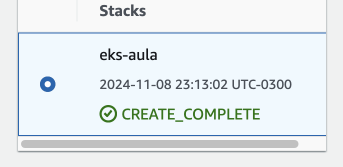

# Desafio
- https://imersao.devopspro.com.br/evento/
- 
# aula 01 -conversao-distancia [docker]

Imagem no dockerhub: https://hub.docker.com/repository/docker/clar1703/conversao-distancia/general

# aula 02 - fake-shop [kubernetes]

- push imagem docker do repositorio https://hub.docker.com/repository/docker/clar1703/fake-shop/general
- criacao do manifest -> aula_02/k8s/deployment.yaml
- testes locais com k3d
- kubectl deployment

```bash
k3d cluster create clusterfakeshop  --servers 1 --agents 2 -p "8080:31000@loadbalancer"
```

```
kubectl apply -f k8s/deployment.yaml
```

# aula 03 - AWS

Criação de roles para EKS e EC2

Template cloudformation ([https://s3.us-west-2.amazonaws.com/amazon-eks/cloudformation/2020-10-29/amazon-eks-vpc-private-subnets.yaml](https://s3.us-west-2.amazonaws.com/amazon-eks/cloudformation/2020-10-29/amazon-eks-vpc-private-subnets.yaml)))

- cloudformation



- eks

-
